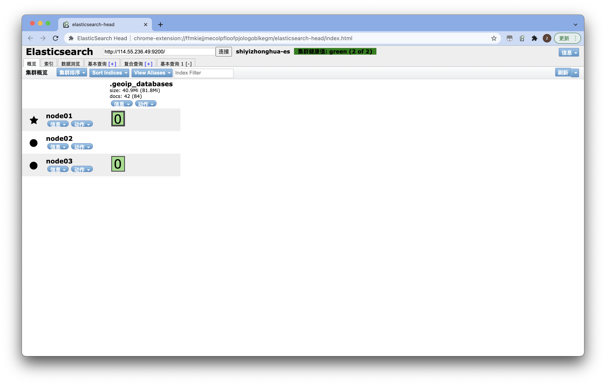

# Elasticsearch使用手册

注：基于阿里云ESC服务器配置集群

## 一、安装

### 1、创建elastic用户

```bash
# 创建es用户，Elasticsearch不支持root用户运行 
# 创建用户
useradd es

# 为用户设置密码
passwd es
```

### 2、安装JDK

1. 执行以下命令，查看yum源中JDK版本。

```shell
yum list java*
```

2. 执行以下命令，使用yum安装JDK11。

```shell
yum -y install java-11-openjdk*
```

3. 执行以下命令，查看是否安装成功。

```shell
java -version
```

### 3、下载

1.官网下载安装包：https://www.elastic.co/cn/downloads/elasticsearch

2.使用ftp传输工具将压缩包传入/usr/local/目录下

3.解压安装包

```bash
# 解压安装包
tar -xvf elasticsearch.tar.gz
```

### 4、修改配置文件

1.修改配置文件elasticsearch.yml

```yml
#修改配置文件
vim conf/elasticsearch.yml
```

```yml
#设置ip地址，任意网络均可访问
network.host: 0.0.0.0 
#
## 集群名称
cluster.name: shiyizhonghua-es
## 节点名称
node.name: node01
## 设置该节点可以被选为master节点
node.master: true
## 设置该节点可以被选为数据节点
node.data: true
#
## 端口
http.port: 9200
transport.port: 9300
## 集群IP
discovery.zen.ping.unicast.hosts: ["114.55.236.49","116.62.195.199","47.47.100.193.135"]
cluster.initial_master_nodes: ["node01", "node02","node03"]
## 设置至少要两个节点同意才能为选为master
discovery.zen.minimum_master_nodes: 2
#
## 跨域相关设置
http.cors.enabled: true
http.cors.allow-origin: /.*/
#
## 暴露公网IP （如果是阿里云服务器，这里需要暴露公网IP，不然集群间会使用私有IP通信，导致通信问题。虚拟机不用配置）
network.publish_host: 114.55.236.49
```

2.修改配置文件jvm.options

```yml
# 说明:在Elasticsearch中如果，network.host不是localhost或者127.0.0.1的话，就会认为是生产环境， 会对环境的要求比较高，我们的测试环境不一定能够满足，一般情况下需要修改2处配置，如下: 
# 1:修改jvm启动参数
vim conf/jvm.options

# 根据自己机器情况修改
-Xms512m 
-Xmx512m
```

3.修改配置文件sysctl.conf

```yml
#2:一个进程在VMAs(虚拟内存区域)创建内存映射最大数量 
vim /etc/sysctl.conf

# 修改vm.max_map_count的值
vm.max_map_count=655360 

#配置生效
sysctl -p
```

4.修改/etc/security/limits.conf

```shell
vim /etc/security/limits.conf

添加如下内容:
* soft nofile 65536 
* hard nofile 131072 
* soft nproc 4096
* hard nproc 4096
```

5.启动elasticsearch

```shell
*# 切换到elsearch用户* 
su - elsearch 
cd bin 
# 启动 
./elasticsearch 或 ./elasticsearch -d #后台启动
```

6.验证是否成功启动

在浏览器中输入IP + 端口，如果返回如下信息则说明启动成功了。

默认端口号是9200

```bash
{
  "name" : "node01",
  "cluster_name" : "shiyizhonghua-es",
  "cluster_uuid" : "aag07AkTRreamm9BXWBD6w",
  "version" : {
    "number" : "7.15.2",
    "build_flavor" : "default",
    "build_type" : "tar",
    "build_hash" : "93d5a7f6192e8a1a12e154a2b81bf6fa7309da0c",
    "build_date" : "2021-11-04T14:04:42.515624022Z",
    "build_snapshot" : false,
    "lucene_version" : "8.9.0",
    "minimum_wire_compatibility_version" : "6.8.0",
    "minimum_index_compatibility_version" : "6.0.0-beta1"
  },
  "tagline" : "You Know, for Search"
}
```

### 注：错误分析

#### 错误情况1

```bash
java.lang.RuntimeException: can not run elasticsearch as root
    atorg.elasticsearch.bootstrap.Bootstrap.initializeNatives(Bootstrap.java:111)
    at org.elasticsearch.bootstrap.Bootstrap.setup(Bootstrap.java:178)
    at org.elasticsearch.bootstrap.Bootstrap.init(Bootstrap.java:393)
    at org.elasticsearch.bootstrap.Elasticsearch.init(Elasticsearch.java:170)
    at org.elasticsearch.bootstrap.Elasticsearch.execute(Elasticsearch.java:161)
    at org.elasticsearch.cli.EnvironmentAwareCommand.execute(EnvironmentAwareCommand.java:86)
    at org.elasticsearch.cli.Command.mainWithoutErrorHandling(Command.java:127)
    at org.elasticsearch.cli.Command.main(Command.java:90)
    at org.elasticsearch.bootstrap.Elasticsearch.main(Elasticsearch.java:126)
    at org.elasticsearch.bootstrap.Elasticsearch.main(Elasticsearch.java:92)
For complete error details, refer to the log at /soft/elsearch/logs/elasticsearch.log

ERROR CLogger.cc@310 Cannot log to named pipe /tmp/elasticsearch-5834501324803693929/controller_log_381 as it could not be opened for writing
2020-09-22 02:59:39,537263 UTC [536] INFO  Main.cc@103 Parent process died - ML controller exiting
```

说明你没有切换成 **elsearch** 用户，因为不能使用 **root** 用户去操作 *ElasticSearch*

```bash
su - es
```

#### 错误情况2

```bash
[1]:max file descriptors [4096] for elasticsearch process is too low, increase to at least[65536]
```

解决方法：切换到 **root** 用户，编辑 **limits.conf** 添加如下内容

```bash
vi /etc/security/limits.conf

# ElasticSearch添加如下内容:
* soft nofile 65536
* hard nofile 131072
* soft nproc 2048
* hard nproc 4096
```

#### 错误情况3

```bash
[2]: max number of threads [1024] for user [elsearch] is too low, increase to at least[4096]
```

也就是最大线程数设置的太低了，需要改成 **4096**

```bash
#解决：切换到root用户，进入limits.d目录下修改配置文件。
vi /etc/security/limits.d/90-nproc.conf
#修改如下内容：
* soft nproc 1024
#修改为
* soft nproc 4096
```

#### 错误情况4

```bash
[3]: system call filters failed to install; check the logs and fix your configuration or disable system call filters at your own risk
```

解决：**Centos6** 不支持 **SecComp**，而 **ES5.2.0** 默认 **bootstrap.system_call_filter** 为  true

```bash
vim config/elasticsearch.yml
# 添加
bootstrap.system_call_filter: false
bootstrap.memory_lock: false
```

#### 错误情况5

```java
Exception in thread "main" org.elasticsearch.bootstrap.BootstrapException: java.nio.file.AccessDeniedException: /soft/elsearch/config/elasticsearch.keystore
Likely root cause: java.nio.file.AccessDeniedException: /soft/elsearch/config/elasticsearch.keystore
  at java.base/sun.nio.fs.UnixException.translateToIOException(UnixException.java:90)
  at java.base/sun.nio.fs.UnixException.rethrowAsIOException(UnixException.java:111)
  at java.base/sun.nio.fs.UnixException.rethrowAsIOException(UnixException.java:116)
  at java.base/sun.nio.fs.UnixFileSystemProvider.newByteChannel(UnixFileSystemProvider.java:219)
  at java.base/java.nio.file.Files.newByteChannel(Files.java:375)
  at java.base/java.nio.file.Files.newByteChannel(Files.java:426)
  at org.apache.lucene.store.SimpleFSDirectory.openInput(SimpleFSDirectory.java:79)
  at org.elasticsearch.common.settings.KeyStoreWrapper.load(KeyStoreWrapper.java:220)
  at org.elasticsearch.bootstrap.Bootstrap.loadSecureSettings(Bootstrap.java:240)
  at org.elasticsearch.bootstrap.Bootstrap.init(Bootstrap.java:349)
  at org.elasticsearch.bootstrap.Elasticsearch.init(Elasticsearch.java:170)
  at org.elasticsearch.bootstrap.Elasticsearch.execute(Elasticsearch.java:161)
  at org.elasticsearch.cli.EnvironmentAwareCommand.execute(EnvironmentAwareCommand.java:86)
  at org.elasticsearch.cli.Command.mainWithoutErrorHandling(Command.java:127)
  at org.elasticsearch.cli.Command.main(Command.java:90)
  at org.elasticsearch.bootstrap.Elasticsearch.main(Elasticsearch.java:126)
  at org.elasticsearch.bootstrap.Elasticsearch.main(Elasticsearch.java:92)
```

也就是说该文件还是所属于**root** 用户，而我们使用 **elsearch** 用户无法操作，所以需要把它变成**elsearch** 

```
chown elsearch:elsearch elasticsearch.keystore
```

### 另：一些linux命令

#### 切换用户

```shell
su - XX
```

#### 添加sudoers

```shell
#添加sudoers文件的写权限
chmod u+w /etc/sudoers

vi /etc/sudoers

#找到 root ALL=(ALL) ALL 这一行,在他下面添加xxx ALL=(ALL) ALL (这里的xxx是你的用户名)

#撤销sudoers文件写权限
chmod u-w /etc/sudoers
```

#### 查看后台进程

```sh
ps -ef | grep elastic

#杀掉进程（xxx为端口号）
kill -9 xxx
```

## 二、ElasticSearchHead可视化工具

### 通过Chrome插件安装

打开 **Chrome** 的应用商店，即可安装 https://chrome.google.com/webstore/detail/elasticsearch-head/ffmkiejjmecolpfloofpjologoblkegm



## 三、kibana

部署在本地，通过更改配置文件即可连接服务器

### 1、安装

```sh
wget https://artifacts.elastic.co/downloads/kibana/kibana-7.15.2-linux-x86_64.tar.gz
```

### 2、解压缩

```sh
tar -xzf kibana-7.15.2-linux-x86_64.tar.gz
```

### 3、配置文件

```sh
vim /config/kibana.yml

server.port: 5601
server.host: "localhost"
server.name: "localhost"
elasticsearch.hosts: ["http://114.55.236.49:9200","http://47.100.193.135:9200","http://116.62.195.199:9200"]
i18n.locale: "zh-CN"
```

### 4、启动

```sh
./bin/kibana

#后台运行
nohup /usr/local/kibana/bin/kibana &
```

## 四、Metricbeat

监测集群情况

### 1、安装（与Elasticsearch版本保持一致且安装在同一服务器内）

```sh
curl -L -O https://artifacts.elastic.co/downloads/beats/metricbeat/metricbeat-7.15.2-linux-x86_64.tar.gz
tar xzvf metricbeat-7.15.2-linux-x86_64.tar.gz
```

### 2、在 Metricbeat 中启用并配置 Elasticsearch x-pack 模块

```sh
#启用模块
./metricbeat modules enable elasticsearch-xpack

#配置模块
cd modules.d
vim elasticsearch-xpack.yml

#将服务器地址添加到hosts设置
hosts: ["http://114.55.236.49:9200"]
```

### 3、配置 Metricbeat 以发送至监测集群

```sh
vim metricbeat.yml
```

```yml
output.elasticsearch:  
	hosts: ["114.55.236.49:9200","47.100.193.135:9200","116.62.195.199:9200"] 
```

### 4、启动Metricbeat

```sh
sudo chown root metricbeat.yml 
sudo chown root modules.d/system.yml 
sudo ./metricbeat -e

#后台运行
nohup ./metricbeat -e -c metricbeat.yml -d "publish" & > nohup.out
```

