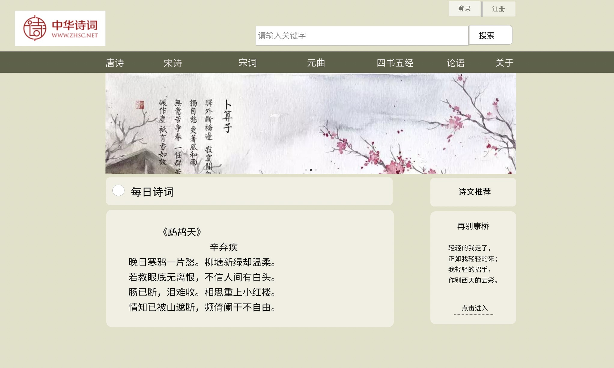
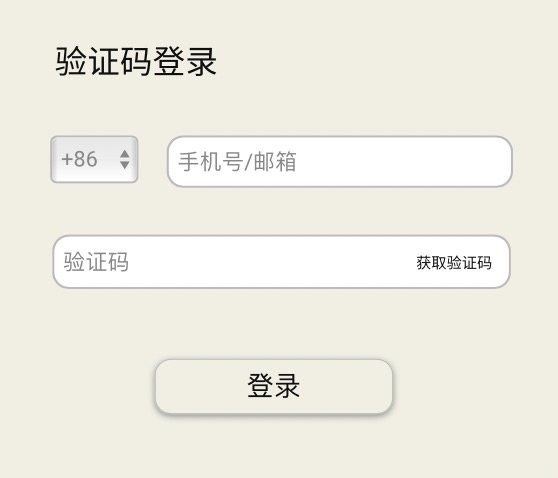

#	NoSQL项目-诗意中华

------

##	目录

[TOC]

------

##	一、版本信息

| 版本号 | 修订人 | 审批人 |  修订日期  |        修订内容        |
| :----: | :----: | :----: | :--------: | :--------------------: |
|   1    |  时政  |  时政  | 2021.10.25 |    项目文档整体架构    |
|   2    | 耿雨欢 |  时政  | 2021.10.30 | 产品功能介绍与原型界面 |
|        |        |        |            |                        |
|        |        |        |            |                        |
|        |        |        |            |                        |

------

##	二、文档说明

###	2.1	文档简介

本文档主要描述诗意中华项目的功能需求点及其设计，目的在于清晰地定义各模块的需求细节及逻辑流程。

###	2.2	文档读者

本文档主要面向以下读者：诗意中华项目的研发人员、测试人员、产品经理、市场运营人员、管理人员等。

###	2.3	专业术语

------

##	三、项目简介

###	3.1	产品定位

诗意中华致力于打造一站式诗词搜索网站，为用户提供方便简洁的浏览体验。

### 3.2	产品特色

简单优雅的设计、快捷便利的搜索、丰富的诗词文章等

### 3.3	用户分析

主要用户为热爱诗词的学生、老师等

------

## 四、项目架构

### 4.1	项目架构图

### 4.2	总体流程图

总体流程可说明产品的基本的用户行为路径，有助产品理解。

------

## 五、详细功能说明

### 5.1	功能列表

功能列表作为功能需求说明的总览，可分模块描述

| 功能       | 描述                                                         |
| ---------- | ------------------------------------------------------------ |
| 登录、注册 | 为用户提供个人账户并且提供多种登录方式，注重用户个人隐私，方便用户数据记录 |
| 每日诗词   | 每天会随机选择一篇诗词置于首页，增加用户的诗词积累           |
| 诗词推荐   | 通过对用户平时的搜索记录进行分析，从而推荐用户喜欢的诗词     |
| 诗词分类   | 将诗词分类为唐诗、宋词、元曲、四书五经、论语等等，并按照一定顺序展示诗词列表 |
| 诗词搜索   | 对用户输入的关键词进行精准识别，输出用户想要搜索的完整诗词   |

### 5.2	原型界面

每一个模块功能的需求都应该包含详细的原型界面图及流程图，此作简单示意图。

* 首页

  

* 注册、登录页面

  

* ...

* ...

### 5.3	用例流程

------

## 六、非功能性需求

### 6.1	性能需求

1、搜索引擎能满足用户需求；

2、前端内容展现应保证用户在WIFI及移动网络下阅读使用体验流畅；

3、万级用户在线时后台信息处理稳定且快速等

### 6.2	系统需求

兼容Chrome、Edge、Safari、FireFox等主流浏览器

### 6.3	运营需求

用户/内容管理系统开发、用户数据分析系统开发等

------

## 七、项目规划

当前主要任务开发网页端，后期如有余力将深入开发小程序等

------

## 八、附录

